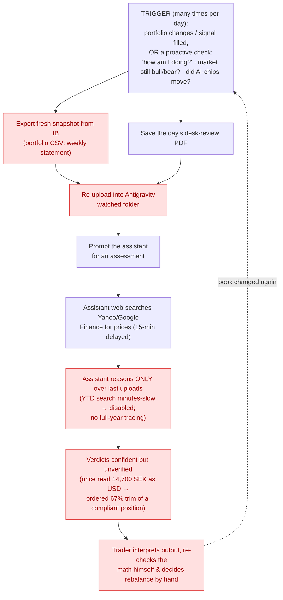
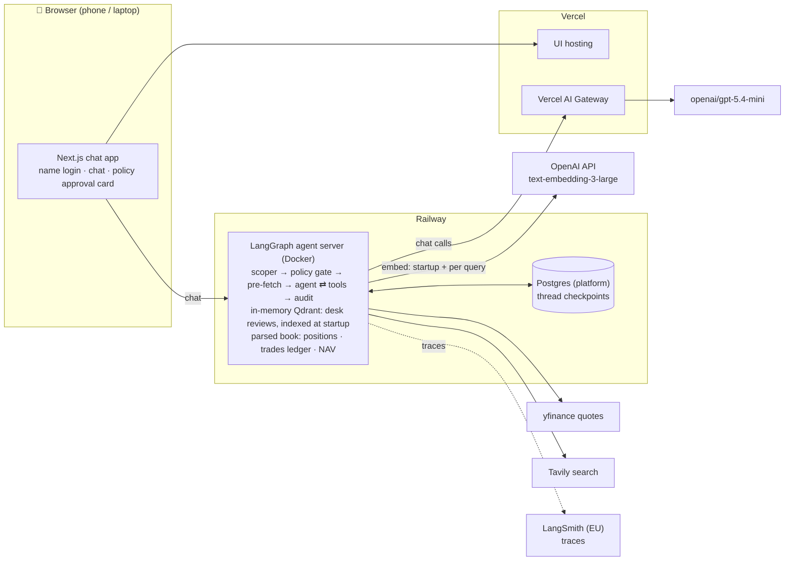
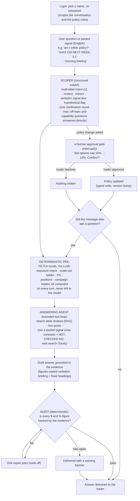

# Certification Challenge: Deliverables

Answers to the Certification Challenge tasks, in order:

- [Task 1: Defining Problem, Audience, and Scope](#task-1-defining-problem-audience-and-scope)
- [Task 2: Proposed Solution](#task-2-proposed-solution)
- [Task 3: Dealing with the Data](#task-3-dealing-with-the-data)
- [Task 5: Test Dataset, Evaluation Harness, and Baseline Conclusions](#task-5-test-dataset-evaluation-harness-and-baseline-conclusions)
- [Task 6: Advanced Retrieval](#task-6-advanced-retrieval)
- [Task 7: Next Steps](#task-7-next-steps)
- [Traceability: deliverables to code](#traceability-deliverables-to-code)

## Traceability: deliverables to code

Each task deliverable mapped to its exact location in the repository, by file path and symbol name. Task 4 has no document section; its deliverable is the deployed prototype itself.

| Task | Deliverable | Code location |
|---|---|---|
| 1 | Problem, audience, scope, "today" workflow | Documentation only (this document); no code artifact |
| 2 | Graph topology (scoper → policy gate → pre-fetch → answer ⇄ tools → audit) | `app/graphs/trading_assistant/graph.py` |
| 2 | Scoper (structured intent output, 11 routes) | `app/graphs/trading_assistant/scope.py` |
| 2 | Policy gate: `interrupt()` approval, typed record, version bump | `app/graphs/trading_assistant/policy.py`, `app/graphs/trading_assistant/policy_model.py` |
| 2 | Deterministic pre-fetch (the evidence digest) | `app/graphs/trading_assistant/prefetch.py` |
| 2 | Book math: exposure, scale-out ladder, P/L, performance, trades ledger | `app/trading/exposure.py`, `app/trading/scaleout.py`, `app/trading/pnl.py`, `app/trading/performance.py`, `app/trading/ledger.py` |
| 2 | Answering agent (evidence-grounded draft, bounded tool loop) | `app/graphs/trading_assistant/answer.py` |
| 2 | Audit gate ($ and % figures, one repair bounce, warning banner) | `app/graphs/trading_assistant/audit.py` |
| 2 | Agent tools: `search_desk_reviews`, market quote, `size_trade_signal`, `search_web` | `app/graphs/trading_assistant/tools.py` |
| 2 | Quote-fetch seam (yfinance) | `app/trading/quotes.py` |
| 2 | Per-entry sizing math | `app/trading/sizing.py` |
| 2 | Wiring: gateway model, in-memory Qdrant indexed at startup, policy store, `DESK_RETRIEVAL` switch | `app/graphs/trading_assistant/dev.py` |
| 2 | Chat UI (name login, streaming chat, policy approval card) | `frontend/` |
| 2 | Deployment | `Dockerfile`, `langgraph.json` |
| 3 | RAG corpus (latest daily + weekly desk reviews) | `data/reviews/` |
| 3 | Book data (positions export, YTD statement) | `data/book/` |
| 3 | PDF extraction (PyMuPDF) | `app/rag/extract.py` |
| 3 | Deterministic RTL repair | `app/rag/rtl.py` |
| 3 | Adaptive structure-aware chunker | `app/rag/chunk.py` |
| 3 | Chunk preview (the human checkpoint) | `docs/chunk_preview/`, generated by `scripts/preview_chunks.py` |
| 3 | Indexing (Qdrant collection, replace-by-document-type) | `app/rag/index.py` |
| 3 | Hybrid retrieval (dense + BM25 with Unicode tokenizer, RRF fusion) | `app/rag/retrieve.py` |
| 3 | Deterministic book parsing (positions snapshot, trades ledger, NAV) | `app/trading/ingest/tactical.py`, `app/trading/ingest/statement.py`, `app/trading/ingest/csv_router.py` |
| 4 | End-to-end prototype, deployed | Live app: <https://day-trading-assistant.vercel.app/> |
| 5 | Test dataset (4 questions with reference answers and contexts) | `evals/eval_dataset.jsonl` |
| 5 | Dataset builder | `evals/build_eval_dataset.py` |
| 5 | Evaluation harness (frozen stages, RAGAS scoring) | `evals/rag_evaluation.py` |
| 6 | Cohere reranker over the fused pool | `RerankingRetriever`, `cohere_rerank` in `app/rag/retrieve.py` |
| 6 | Retrieval-mode switch shared by production and eval | `apply_retrieval_mode` in `app/rag/retrieve.py` |
| 6 | Production flip of the retrieval mode | `DESK_RETRIEVAL` read in `app/graphs/trading_assistant/dev.py` |
| 6 | Generation prompt rule | `COMPLETENESS_RULE` in `app/graphs/trading_assistant/answer.py` |
| 6 | Eval variants (baseline / rerank / rerank_prompt) | `evals/rag_evaluation.py` |
| 7 | Persistence seams the plan builds on | policy load/save in `app/graphs/trading_assistant/dev.py`; Qdrant client injection in `app/rag/index.py` |
| 7 | Upload building blocks | `app/trading/ingest/csv_router.py`; `replace_document` in `app/rag/index.py` |
| 7 | Signal-eval deepening target | `make_size_signal_tool` in `app/graphs/trading_assistant/tools.py` |

---

# Task 1: Defining Problem, Audience, and Scope

---

## 1. One-sentence problem statement

> A signal-following retail options day-trader has no fast, reliable way to know whether his live portfolio still satisfies his own exposure and hedging rules and stays aligned with his trading desk's current market thesis, so keeping the book in balance means constant manual reconciliation.

---

## 2. Why this is a problem for this user

**Who has the problem?** A segment of active, *non-technical* retail options day-traders who trade a signal desk's calls on Interactive Brokers and run a strictly rules-based book: ~1% of the portfolio per entry (3–4 contracts), options ≤10% of the book, a 10–15% market hedge, a ~15% cross-hedge against the prevailing sentiment (e.g. AI), and a fixed scale-out: sell one contract at +100%, another at +200%, leave the rest as a "moonshot."

**What are they trying to do?** Keep that book continuously *compliant with their rules and aligned to the desk's daily/weekly thesis* while acting on dozens of signals a day, answering, after each change: am I still within my exposure policy, aligned with today's thesis, taking profits correctly, and what do I need to adjust?

The decision starts **before** the trade, too: when a signal arrives ("AAOI 150 NEXT WEEK 3.1"), he has minutes to size it under his rules, set the exit levels for its expiry tier, and check the desk's current stance on the name, all before entering.

He also checks **proactively**, not just after a trade. Intraday he asks *"how am I doing?"* to confirm the book still isn't in violation even when he hasn't bought anything, since options decay, expire, or get priced out on their own. He reads the **market regime**, whether the main indices (S&P 500, QQQ, Russell 2000, VIX, etc.) are still bullish or bearish, to decide whether to act, and he watches for a **sharp move in a segment he's exposed to** (e.g. AI or chips) that shifts the picture for part of his book. In every case he wants the same thing: a concrete answer telling him *exactly what to change*.

**How do they handle it today?** Through a manual **upload loop** into a home-built assistant (Antigravity). Whenever the portfolio changes, several times a day, the trader exports a fresh snapshot from IB (the **portfolio CSV**, and the **weekly** statement when he needs recent history) and drops the day's desk-review PDF into folders the assistant watches, then prompts it for an assessment. The **full-year (YTD) statement is too large to use: a single position-history search across its ~9,500 lines took minutes, so he told the assistant to stop reading it**, leaving full-year position history effectively out of reach. For current prices, he asks the assistant to **web-search Yahoo/Google Finance** (a 15-minute delay is fine for him). The assistant only ever reasons over whatever was last uploaded.

**Why isn't that good enough?** It is **stale by default**: between uploads the assistant's picture is out of date, so staying current means re-uploading every time anything changes, many times a day. The files are **big and costly**: the weekly statement is slow and expensive to parse each time, and **full-year searches were so slow he disabled them**, so position-history "tracing" is effectively unavailable. There is **no live or automated data feed**: everything is a manual export, and prices come from **ad-hoc web searches** the assistant runs on demand (15-minute delayed), not a real market connection. And the actual **synthesis still lands on the trader**: reconciling positions against the rules and the desk's thesis, then deciding the rebalance, by hand. Worst of all, **the verdicts themselves can't be trusted without re-checking**: the assistant's reasoning-based arithmetic once read a 14,700 SEK position as US dollars and ordered an immediate 67% trim of a compliant holding, and because right and wrong answers arrive in the same confident voice, every number it produces has to be re-verified by hand, which is the very work it was meant to take over.

---

## 3. "Today" workflow diagram

**Pain points (red):**

- **Export (B)**: manual, no API; needed on every change.
- **Re-upload (D)**: repeated on *every* portfolio change, many times a day.
- **Reasons only over last uploads (G)**: stale between uploads; weekly is slow/costly; **YTD searches so slow he disabled them**, so no full-year tracing.
- **Unverified verdicts (I)**: arithmetic errors arrive in the same confident voice as correct answers (14,700 SEK read as USD → a false "severe violation" and a trim order), so every number must be re-checked by hand.
- **Manual synthesis (H)**: reconciling positions vs. rules vs. thesis and deciding the rebalance is still entirely human.

> The price web-search step (F) is the assistant's, not manual, but it's ad-hoc and 15-minute delayed, not a live feed.

> **Core insight:** the pain isn't *reading*; it's the **manual, repeated re-uploading to keep a stale assistant current**, on files too big to parse cheaply, with the judgment left to the trader.

---

## 4. Evaluation questions / input–output pairs

The real questions the trader asks, every one scoped to his actual positions; the portfolio is the lens, not the market in the abstract. Ground-truth answers to be filled in from the real source documents.

| #   | Question (input)                                                                                                  | Expected answer (output)                                                                                                                                                                                                         |
| --- | ----------------------------------------------------------------------------------------------------------------- | -------------------------------------------------------------------------------------------------------------------------------------------------------------------------------------------------------------------------------- |
| 1   | What's the desk's bias for the names/themes I'm actually holding?                                                 | Desk's read filtered to my positions: where it backs me, where it's turning cautious                                                                                                                                             |
| 2   | Of my current positions, which does the desk favor vs. want to trim/avoid?                                        | Per-position favor / trim / avoid call                                                                                                                                                                                           |
| 3   | What's the desk's read on [named ticker]?                                                                         | The desk's stance + reasoning for that name/theme                                                                                                                                                                                |
| 4   | Has the desk's stance on [named ticker] shifted this week vs. last?                                               | *Deferred to Demo Day scope: requires an accumulating review archive; the certification corpus holds only the latest daily + latest weekly review*                                                                               |
| 5   | Given my book, am I within my exposure & hedging policy?                                                          | Per-rule pass/breach (options %, hedge %, cross-hedge %)                                                                                                                                                                         |
| 6   | Which of my options have hit +100% / +200% and should be scaled out?                                              | Positions crossing each threshold + the contract to sell                                                                                                                                                                         |
| 7   | Show me this year's trade history for [ticker].                                                                   | Filtered list of that ticker's trades                                                                                                                                                                                            |
| 8   | Given today's thesis and my book, what should I rebalance?                                                        | Concrete trim / add / hedge moves tied to rules + thesis                                                                                                                                                                         |
| 9   | How am I doing now (haven't traded; decay/expiry), and is my hedge still adequate for where the market's heading? | Whether decay / expiry / drift pushed me out of policy or left me under-hedged                                                                                                                                                   |
| 10  | Is the market trending with or against my book right now?                                                         | The regime read against my net exposure: is my positioning aligned or exposed                                                                                                                                                    |
| 11  | Did AI/chips move sharply today, and does it hit my book?                                                         | Segment move + my exposed positions + what to adjust                                                                                                                                                                             |
| 12  | Signal "AAOI 150 NEXT WEEK 3.1": do I take it, and how big?                                                       | Parsed contract (call, chain-verified expiry); max contracts under sizing rules; stop/target/scale levels for its expiry tier; desk bias & tier on the name; conflicts with existing inventory; IV rank flagged for manual check |
| 13  | Morning briefing: where do I stand going into today?                                                              | Book status + per-rule flags, hedge ratio, the desk's read for today, index regime                                                                                                                                               |

---

# Task 2: Proposed Solution

---

## 1. One-sentence solution

> A browser-based agentic assistant that holds the trader's parsed book and his desk's Hebrew market reviews, checks every position against his own exposure rules with deterministic math, and answers *exactly what to change*.

How it kills the Task 1 pains: the synthesis (H), reconciling positions vs. rules vs. thesis and deciding the rebalance, is now the agent's job, delivered as an audited answer instead of raw context for the trader to interpret. On the re-upload loop (D): the prototype demonstrates the state *after* the trader has uploaded his files, with the committed book export and desk reviews parsed and indexed into the server at startup, standing in for that upload. On Demo Day he will still upload each new export and review himself, or potentially won't have to at all, if by then the book is drawn live from the IB API (which would also retire the manual-export pain (B)) and the review PDFs arrive through a Discord bot. The oversized-files problem (G) is solved structurally: the full-year statement is parsed once into a queryable trades ledger (deterministic code, not context stuffing), so full-year trade tracing works for the first time. The unverified-verdict pain (I) is answered by construction rather than by prompting: every number comes from deterministic, FX-normalized code (a SEK position can never be read as USD), the answer must copy figures verbatim from that evidence, and a deterministic audit node checks every dollar and percent figure in the answer against the evidence; an unbacked figure bounces the answer once for repair, and a second failure is delivered with a visible warning banner, so a confident-but-wrong number cannot reach the trader unflagged.

---

## 2. Infrastructure: components and why each was chosen

| #   | Component               | Choice                                                                                                                                         | Why (one sentence)                                                                                                                                                                                                                                                    |
| --- | ----------------------- | ---------------------------------------------------------------------------------------------------------------------------------------------- | --------------------------------------------------------------------------------------------------------------------------------------------------------------------------------------------------------------------------------------------------------------------- |
| 1   | **LLM**                 | `openai/gpt-5.4-mini` (via gateway)                                                                                                            | Strong, cheap tool-caller that reads Hebrew and answers in English; the gateway makes a frontier-model swap a config change if evals demand it.                                                                                                                       |
| 2   | **LLM gateway**         | **Vercel AI Gateway**                                                                                                                          | Satisfies the gateway requirement while adding spend tracking, budget alerts, and model failover.                                                                                                                                                                     |
| 3   | **Agent orchestration** | **LangGraph ≥ 1.0**                                                                                                                            | The structured graph (scoper → policy gate → deterministic pre-fetch → answering agent → audit) plus native `interrupt()` and checkpointing are exactly the guardrail primitives this design needs.                                                                   |
| 4   | **Tools**               | Purpose-built deterministic pandas tools + `yfinance` (behind an injectable quote-fetch seam) + **Tavily**                                     | Financial math must be exact and testable, never LLM arithmetic; yfinance is the only free quote source covering the trader's international tickers; Tavily handles the *narrative* ("what moved and why").                                                           |
| 5   | **Embedding model**     | OpenAI `text-embedding-3-large` (direct, not via gateway)                                                                                      | Every retrieval is cross-lingual (English questions ↔ Hebrew corpus), which demands the stronger multilingual embedder; embeddings don't route through the gateway.                                                                                                   |
| 6   | **Vector DB**           | **Qdrant**, embedded in-memory in the agent server                                                                                             | The small corpus (latest daily + weekly review) is re-indexed from the committed PDFs at startup, so the prototype needs zero external vector infrastructure, and the client API is identical if a hosted Qdrant is swapped in later.                                 |
| 7   | **Memory**              | LangGraph **checkpointer** (threads, platform Postgres on Railway) + a versioned in-process **policy store** behind an injected load/save seam | Thread state persists so a returning name resumes its conversation, and the trader's exposure policy is a typed, versioned record editable only through the human-approval gate; the injected seam is where a database-backed store lands without touching the graph. |
| 8   | **Monitoring**          | **LangSmith** (EU endpoint) + AI Gateway dashboard                                                                                             | LangSmith holds full traces privately (the committed artifacts are summary tables only); the gateway dashboard tracks spend.                                                                                                                                          |
| 9   | **Evaluation**          | **RAGAS**                                                                                                                                      | Five LLM-judged metrics (context recall, context precision, entity recall, faithfulness, answer accuracy) over a hand-curated dataset drawn from real trader transcripts score retrieval and answers, traced in LangSmith.                                            |
| 10  | **User interface**      | Purpose-built Next.js chat app on the LangGraph SDK                                                                                            | Streaming chat against the LangGraph server, with a passwordless name login that scopes thread and policy per user and an in-chat approval card for policy changes, responsive in a phone or laptop browser.                                                          |
| 11  | **Deployment**          | **Railway** (agent server, Docker) + **Vercel** (UI)                                                                                           | A real long-running server for the ingestion/pandas workload with platform Postgres for checkpointing, plus zero-config hosting for the Next.js UI.                                                                                                                   |
| 12  | **Ingestion**           | PyMuPDF + deterministic RTL-repair + adaptive structure-aware chunker                                                                          | The Hebrew desk reviews need structure-preserving extraction with mechanical artifact repair, and per-document heading detection because the desk's template drifts between issues.                                                                                   |

---

## 3. Agent workflow, end to end

How a question flows: the trader picks his name (the `user_id` scopes his conversation thread and his policy record) and asks, in English, something like *"how am I doing, and is my hedge still right for where the market's heading?"* The scoper classifies it with structured output: multi-label intent (`status_check` + `market_regime`), extracted tickers, verbatim signal text, and a *hypothetical* flag so "what if I raised my cap?" is analyzed rather than enacted; an ambiguous query gets exactly one clarifying question. The deterministic pre-fetch then runs every book computation in code on every turn (exposure vs. limits, the scale-out ladder, P/L, positions, campaign trades when a ticker is named), so the compliance math can never be skipped or hallucinated, and its results become an evidence digest with every figure pre-formatted. The answering agent fills the gaps with tools it chooses: retrieving from the desk-review corpus (cross-lingual RAG over the latest daily + weekly, where the *daily supersedes the weekly on conflict*), pulling live quotes, or calling Tavily when the question needs today's narrative. The same machinery serves the trader's two highest-frequency uses: pasting a Discord signal (*"AAOI 150 NEXT WEEK 3.1"*) invokes the sizing tool (max contracts under his own sizing rules, plus an explicit NOT-CHECKED list naming what the verdict did not verify, IV rank first among them), while *"morning briefing"* composes the book scans with the desk's latest read into a fixed-heading start-of-day report. The draft answer must copy every figure verbatim from the evidence; a deterministic audit node then checks exactly that: every dollar and percent figure in the answer must be backed by the digest or a tool result. One failed audit sends the draft back for a single repair pass with tools disabled; a second failure is delivered with a visible warning banner rather than silently guessing.

Where the human stays in the loop: two gates, one hard and one structural. The hard gate: changing the trader's own rules (*"raise my options cap to 12%"*) routes through a LangGraph `interrupt()`, where the agent reads the change back (old value → new value) and waits for explicit confirmation in the UI's approval card before writing the typed, version-bumped policy record; a decline writes nothing, and either way a question asked in the same message still gets answered against the just-decided policy. The structural gate: the application never executes trades; every recommendation terminates at the trader, who remains the only actor able to act on his book, so every output is human-reviewed by construction. The thread checkpointer carries the conversation across visits, and the policy record keeps each user's rules, so the trader logs in with the same name, asks as often as he likes, and his own constraints are always the ones being enforced.

---

# Task 3: Dealing with the Data

---

## 1. Default chunking strategy, and why

**The strategy: adaptive, structure-aware chunking on the document's own layout signal** (`app/rag/chunk.py`), applied after PyMuPDF extraction and a deterministic RTL-repair pass:

1. **Heading detection by font size, per document.** The char-weighted modal font size of the document is taken as body text; any line ~2pt larger is a heading. A *section* is the body text between consecutive headings.
2. **Packing to a character budget.** Sections are packed into chunks of 200–1,200 characters; fragments under 40 chars are merged into a neighbour, and page furniture (lines repeating on 3+ pages) is dropped.
3. **Tables stay row-atomic.** Table regions arrive from extraction as pipe-joined row lines, so a ticker always stays on the same row as its desk action: a chunk can never separate "MU" from "Core long / add only after a pullback".
4. **Heading lives in two places.** Each section heading is *prepended into the chunk's searchable text* (so both dense and BM25 retrieval can match on it) and kept as `section` metadata for citation. Every chunk also carries `source`, `chunk_id`, `review_date`, `doc_type`, and `pages`.

On the committed corpus this yields **17 chunks (avg 615 chars) for the daily review and 32 chunks (avg 722 chars) for the weekly**, every one inspectable in `docs/chunk_preview/`, traceable by `chunk_id` from a retrieval hit back to the exact PDF pages.

**Why this decision.** Three properties of the data forced it:

- **The desk's template drifts between issues.** A fixed-selector or fixed-size chunker breaks the moment the desk reorders sections; font-size headings are the one signal that survives template drift, so the chunker is *per-document adaptive* rather than tuned to one issue.
- **The corpus is RTL Hebrew mixed with English tickers.** Naive extraction scrambles Hebrew reading order; repair had to be deterministic and happen *before* chunking. The lexical (BM25) side of retrieval needed the same care: BM25 matches word tokens between the query and the indexed chunks, and a Latin-only tokenizer (`[a-z0-9]+`) discards every Hebrew word at indexing time, so a mostly-Hebrew chunk would be indexed as little more than its scattered English tickers. The Unicode tokenizer (`\w+`) keeps Hebrew tokens, so the lexical index actually represents the documents.
- **The unit of meaning is the section, not the paragraph.** A desk review is a sequence of "thesis blocks" (a catalyst, the desk's read, the affected tickers). Semantic-boundary chunking at the section level with a bounded size keeps each retrieved chunk a self-contained, citable desk opinion with a stable id, traceable from any retrieval hit back to the exact PDF pages.

## 2. Data sources and external APIs: roles and interaction

**Own data, source 1: the desk's review PDFs (the RAG corpus).** The trader's desk publishes a daily and a weekly market review (Hebrew, with English tickers and terms). These carry the *judgment* the assistant must retrieve: market regime, favored/avoided sectors, per-ticker bias and desk actions. The corpus deliberately holds only the **latest daily + latest weekly**, since a stale desk view is worse than none. In this prototype those are the two committed PDFs, indexed at startup and served to every user; letting the trader upload a new review that replaces the prior one of its type is a Demo-Day evolution, not part of this build. Retrieval over this corpus is cross-lingual by design: the trader always asks in **English**, the content is largely Hebrew.

**Own data, source 2: the trader's IBKR book (deliberately *not* RAG).** The open-positions export (`Tactical_Boot.csv`) and the YTD activity statement (~9.5k lines, multi-currency, 27 sections) are parsed **deterministically** into a positions snapshot, a trades ledger, and NAV, never embedded. Embedding a financial table invites the exact failure the app exists to prevent (a SEK figure read as USD, a missed fill); exposure math must come from code, not from similarity search. This split, *judgment is retrieved, numbers are computed*, is the central data decision of the build.

**External API 1: Tavily (agentic web search).** The desk reviews freeze at publication time; Tavily is the agent's tool for *today's narrative*: "what moved and why", news on a ticker the desk hasn't covered. It is a tool the agent chooses to call, not a pipeline stage.

**External API 2: yfinance (quotes, behind an injectable quote-fetch seam).** Live prices and option-chain lookups for sizing math. Free, and the only free source covering both options and the trader's international tickers.

*(Supporting model APIs: OpenAI* `text-embedding-3-large` *embeds the corpus and queries, chosen specifically for cross-lingual strength; the gateway-served* `gpt-5.4-mini` *is the reasoning LLM.)*

**How they interact during usage.** The default retrieval mode over the corpus is **hybrid**: dense (`text-embedding-3-large`, cosine, Qdrant) and BM25 (Unicode tokenizer, rebuilt per query over the user's chunks) fused with reciprocal rank fusion, top-5, exposed to the agent as the `search_desk_reviews` tool. A typical high-value flow composes all sources in one turn. The trader pastes a Discord signal ("AAOI 150 NEXT WEEK 3.1"), and the graph parses the signal (code), sizes it against NAV and the policy record (deterministic math over the *parsed book*), pulls the live quote (yfinance), and cross-references the desk's bias on the name (RAG over the reviews), with the desk tool's footer deterministically listing which *held* book names appear in the retrieved text, tying the two data worlds together in every retrieval. The morning-briefing route runs the same composition proactively: book scans (code) + latest desk read (RAG) + optional narrative (Tavily), which mirrors how the real trader's transcripts show him actually working.

---

# Task 5: Test Dataset, Evaluation Harness, and Baseline Conclusions

---

## 1. The test dataset

Four English questions over the Hebrew/English corpus, taken from transcripts of the real trader working with an LLM co-pilot (July 4–8, 2026): one asked verbatim, three instantiating his recurring question patterns on content the corpus covers. Each carries a hand-written reference answer and reference contexts (the corpus chunks that answer it); both were verified against the documents. The four questions deliberately stress different retrieval failure modes:

| #   | Question                                                                                      | Type                 | Reference answer (opening)                                                                                                                   | Reference contexts |
| --- | --------------------------------------------------------------------------------------------- | -------------------- | -------------------------------------------------------------------------------------------------------------------------------------------- | ------------------ |
| 0   | What are the main tactical guidelines to follow for this week's trading sessions?             | broad, multi-chunk   | "The critical rule for the week: don't chase every headline — build the book around receivers with proven pricing power…"                    | 4 weekly chunks    |
| 1   | What is the desk's current view on Micron (MU)?                                               | **cross-document**   | "The desk is core long Micron — it is the #1 name on the weekly list — but disciplined on entry and with a new legal risk flag…"             | 2 weekly + 2 daily |
| 2   | What is the desk's bottom line for today, and what actions does it recommend before the open? | doc-scoped summary   | "Bottom line: AI is not leaving the market — it is changing layers. Momentum names and crowded semis are absorbing pressure…"                | 3 daily chunks     |
| 3   | What does the desk say about the Apple-Broadcom deal, and who benefits from it?               | narrow, single-chunk | "Apple is expanding its agreement with Broadcom into a deal expected to exceed $30 billion, producing more than 15 billion chips in the US…" | 1 daily chunk      |

## 2. The evaluation harness

`evals/rag_evaluation.py` runs in three frozen stages (each writes an artifact that later runs reuse, so LLM calls are never repaid accidentally):

- **Retrieve + generate.** Retrieval is identical to the production app (same index, same embeddings, same hybrid retriever, top-5). Generation is fixed: the production model at temperature 0, answering from the retrieved chunks formatted exactly as the app's desk-search tool presents them.
- **Score with RAGAS**: context recall, context precision, context entity recall, faithfulness, and answer accuracy, judged by OpenAI `gpt-5.4` (a larger model than the generator).

## 3. Baseline results and conclusions

Baseline = the production hybrid retriever (dense + BM25 + reciprocal rank fusion, top-5). Mean over the dataset:

| ctx recall | ctx precision | entity recall | faithfulness | answer acc. |
| ---------- | ------------- | ------------- | ------------ | ----------- |
| 0.767      | 0.656         | 0.521         | 0.927        | 0.562       |

**1. When the answer is split across the two reviews, retrieval tends to bring back only one of them.** On the MU question, all five retrieved chunks came from the weekly review; the daily review's chunk about the antitrust lawsuit against Micron was never retrieved. The generated answer therefore said "core long" without ever mentioning the lawsuit. It sounds complete, but half the story is missing. (This also explains why entity recall is the lowest metric, 0.521: the ticker lists sit in exactly the chunks that get missed.)

**2. Retrieval, not generation, is the bottleneck.** Faithfulness is 0.927, the generator faithfully reports whatever it is given, yet answer accuracy is only 0.562: answers cannot contain facts that were never retrieved. Improvement effort belongs on the retriever.

**3. The top-5 carries dead weight.** Precision of 0.656 means one to two of every five retrieved chunks are irrelevant to the question.

**4. What already works.** Single-document questions score perfect context recall, and cross-lingual English→Hebrew retrieval demonstrably functions. The problems are specific and addressable: cross-document coverage and the final ranking of what enters the top-5.

---

# Task 6: Advanced Retrieval

---

## 1. The advanced retrieval technique, and why

The chosen technique is cross-encoder reranking: Cohere `rerank-v3.5` over the hybrid retriever's full fused pool. The first stage is unchanged (dense + BM25 fused with reciprocal rank fusion), but instead of cutting the fused ranking at 5, the reranker rescores all ~16 fused candidates against the query and the top-5 is taken from its ordering.

Why this was expected to help: the Task 5 baseline observed that on the cross-document question all five retrieved chunks came from one document, and the hypothesis was that the missing daily-review chunks were already in the ~16-candidate fused pool, just below the top-5 cut: a ranking failure, not a recall failure. A multilingual cross-encoder reads each query–chunk pair jointly (crucial for English questions over Hebrew chunks) and reorders that same pool, so it attacks exactly the diagnosed weakness while changing exactly one variable (Section 2 confirms the hypothesis).

Both retrieval modes stay live in production behind one env switch, `DESK_RETRIEVAL=baseline|rerank`, resolved through the same `apply_retrieval_mode` factory the eval harness uses, so the variants being measured are byte-identical to the modes being deployed, and the change is instantly revertible.

## 2. Performance vs. the original pipeline

Same frozen dataset, same generation, same judge; only the retriever differs. Mean over the dataset:

| variant                             | ctx recall | ctx precision | entity recall | faithfulness | answer acc. |
| ----------------------------------- | ---------- | ------------- | ------------- | ------------ | ----------- |
| baseline (hybrid + RRF top-5)       | 0.767      | 0.656         | 0.521         | 0.927        | 0.562       |
| **rerank (Cohere over fused pool)** | **0.875**  | **0.956**     | **0.557**     | **0.950**    | **0.812**   |

Every metric improved. The two that matter most:

- Context precision rose 0.656 → 0.956: the reranker almost eliminated the noise riders in the top-5.
- The cross-document failure is fixed, and the ranking hypothesis confirmed: on the Micron question the baseline retrieved 5/5 chunks from the weekly review and missed the daily review's lawsuit chunk entirely, while the rerank run retrieved all four reference contexts, including both daily chunks. Since the reranker can only reorder what the first stage put in the fused pool, those chunks must have been in the pool all along, below the cut. The answer now carries both the "core long" view and the legal risk flag (answer accuracy 0.5 → 1.0 on that question).

## 3. Improving another piece: the generation prompt

With retrieval fixed at `rerank`, the Apple-Broadcom question still scored answer accuracy 0.5 despite perfect retrieval: asked "who benefits?", the model named only AVGO and AAPL while the retrieved chunk also listed QCOM, SWKS, and QRVO; the prompt's "keep it tight" rules were summarizing ticker lists away. The change is one rule added to the production system prompt (`COMPLETENESS_RULE` in `app/graphs/trading_assistant/answer.py`): when the question asks who or what is affected, name every ticker and entity the evidence gives for it, never summarize a list of names away. The harness imports the same string as a third variant, `rerank_prompt`, whose retrieved chunks are byte-identical to the `rerank` run, so only the prompt differs.

Dataset means for both variants, and the targeted question:

| mean over dataset          | ctx recall | ctx precision | entity recall | faithfulness | answer acc. |
| -------------------------- | ---------- | ------------- | ------------- | ------------ | ----------- |
| rerank                     | 0.875      | 0.956         | 0.557         | 0.950        | 0.812       |
| rerank + completeness rule | 0.833      | 0.954         | 0.599         | 0.914        | 0.750       |

| Apple-Broadcom question        | ctx recall | ctx precision | entity recall | faithfulness | answer acc. |
| ------------------------------ | ---------- | ------------- | ------------- | ------------ | ----------- |
| rerank                         | 1.000      | 1.000         | 0.571         | 0.800        | 0.500       |
| **rerank + completeness rule** | 1.000      | 1.000         | 0.615         | **1.000**    | **1.000**   |

The mean reads as a slight regression; per-question inspection says otherwise:

- The judge's scores are noisy at this sample size: the three context metrics were computed twice on identical retrieved contexts yet moved (means by up to ±0.042, single cells by up to 0.167), and with four questions scored in 0.25 steps, one judge flip moves mean answer accuracy by 0.0625.
- All the drops are single 0.25 flips on near-identical answers; the faithfulness dip traces to one answer getting longer (more claims to grade), with every name in it verified present in the retrieved chunks.
- The gain is a two-step move (0.5 → 1.0) on exactly the targeted question, corroborated by the response itself: before, "Broadcom (AVGO) directly, Apple (AAPL) indirectly"; after, AVGO, AAPL, QCOM, SWKS, QRVO.

---

# Task 7: Next Steps

---

## 1. What stays for Demo Day

- The deterministic core stays as-is: judgment is retrieved, numbers are computed. Every book figure comes from deterministic FX-normalized code, the pre-fetch runs every book computation on every turn, and the audit gate blocks any $ or % figure that isn't backed by evidence. This is the app's entire safety argument, the reason a confident-but-wrong number can't reach the trader, and it is built and working.
- The graph and the human gates stay: the scoper → policy gate → pre-fetch → answering agent → audit topology, the `interrupt()` approval card for policy changes, and the structural guarantee that the app never executes trades.
- Retrieval stays, promoted to the Task 6 winner: the ingestion pipeline (PyMuPDF → RTL repair → adaptive chunking) and hybrid retrieval are unchanged, and the Cohere reranker becomes the default (`DESK_RETRIEVAL=rerank`) on the strength of the Task 5/6 numbers (context precision 0.656 → 0.956, the cross-document failure fixed).
- The evaluation harness stays: every change below gets measured on the same frozen dataset before it ships; it is the regression net that makes the rest of this list safe to build.
- The deployment shape stays: Railway (agent server) + Vercel (UI) already serves the app publicly and leaves room for the persistence work below.

## 2. What changes for Demo Day, in priority order

1. Real authentication: the current login is a passwordless name picker, right for a prototype demo, wrong for real data. This app holds a trader's actual brokerage book, and no real user would put that in an unsecured app, so proper login (and encrypting user data at rest) is the precondition for everything else on this list, and it is bounded, well-trodden work.
2. Real persistence: the vector index is in-memory and rebuilt at startup, and the policy record lives in server memory, so a restart loses policy edits. Swapping in a hosted Qdrant and a database-backed policy store is the cheapest structural win on the list, because both land behind seams that were deliberately left open for them (the policy load/save seam; an identical Qdrant client API). This is what makes the app genuinely multi-user and restart-safe.
3. Self-serve uploads: today the served book and reviews are committed files standing in for the trader's upload. Letting him upload them himself (a new day's review replaces the old one, a fresh book export replaces the snapshot) is the highest user value per unit of work, because every hard part already exists and is tested (CSV parsing, RTL repair, chunking, replace-by-document-type indexing, per-user filtering); the missing piece is only the transport: an upload endpoint, a format sniff, and storage. This also turns per-user corpus isolation from a design property into a live feature.
4. Full pre-trade signal evaluation: the trader's transcripts show that evaluating a pasted signal before entering is his #1 real use, and today the tool answers only the sizing half, "you may buy N contracts under your rules", plus an honest list of what it did not check. The full version composes, in one answer, everything he actually checks before a trade: the allowed size, the exit levels his rules set for that option's expiry tier, the desk's current stance on the ticker, and the standing reminder that IV rank must be checked manually. Bounded work: each ingredient already exists in the app; the change is composing them into the one route where they matter most.

## 3. Deferred beyond Demo Day, and why

- A live IB API feed and a Discord bot for the review PDFs would remove the last manual steps entirely (no exports, no uploads), but each is an integration project on its own, and once self-serve uploads exist the remaining pain is seconds per day. They are the stated direction, not Demo-Day work.
- Evaluation hardening (a larger question set and repeated judge passes; the Task 6 analysis measured visible judge noise at four questions) would make the numbers tighter; valuable, but it improves confidence in the product rather than the product itself.

The reasoning across all of it: keep everything that carries the safety guarantees, secure the app before inviting real data into it, spend the remaining work budget where seams were deliberately left open, and let the trader's real usage, not speculation, pick which feature gets deepened.
