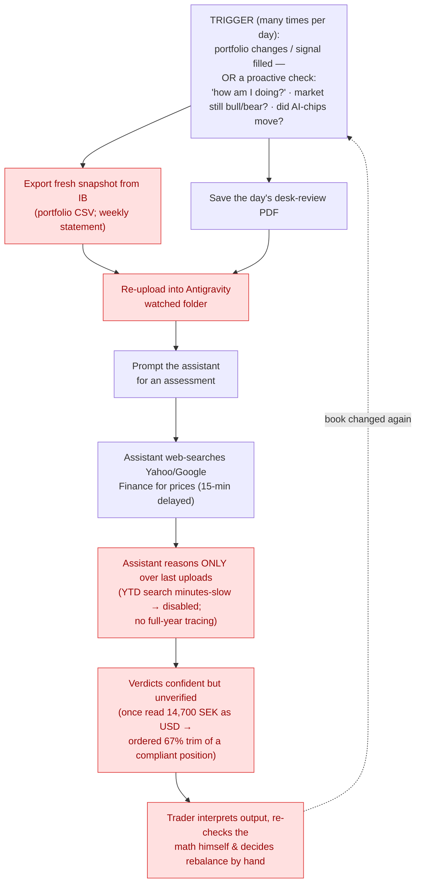

# Task 1 — Defining Problem, Audience, and Scope

**Role: AI Solutions Engineer**

> Deliverable for Task 1 of the Certification Challenge. Companion evaluation
> questions live in [`eval_questions.md`](eval_questions.md).

---

## 1. One-sentence problem statement

> A signal-following retail options day-trader has no fast, reliable way to know
> whether his live portfolio still satisfies his own exposure and hedging rules and
> stays aligned with his trading desk's current market thesis — so keeping the book
> in balance means constant manual reconciliation.

---

## 2. Why this is a problem for this user

**Who has the problem?** A segment of active, *non-technical* retail options
day-traders who trade a signal desk's calls on Interactive Brokers and run a
strictly rules-based book: ~1% of the portfolio per entry (3–4 contracts), options
≤10% of the book, a 10–15% market hedge, a ~15% cross-hedge against the prevailing
sentiment (e.g. AI), and a fixed scale-out — sell one contract at +100%, another at
+200%, leave the rest as a "moonshot."

**What are they trying to do?** Keep that book continuously *compliant with their
rules and aligned to the desk's daily/weekly thesis* while acting on dozens of
signals a day — answering, after each change: am I still within my exposure policy,
aligned with today's thesis, taking profits correctly, and what do I need to adjust?

The decision starts **before** the trade, too: when a signal arrives ("AAOI 150 NEXT
WEEK 3.1"), he has minutes to size it under his rules, set the exit levels for its
expiry tier, and check the desk's current stance on the name — before entering.

He also checks **proactively**, not just after a trade. Intraday he asks *"how am I
doing?"* to confirm the book still isn't in violation even when he hasn't bought
anything — options decay, expire, or get priced out on their own. He reads the
**market regime** — are the main indices (S&P 500, QQQ, Russell 2000, VIX, etc.)
still bullish or bearish — to decide whether to act, and he watches for a **sharp
move in a segment he's exposed to** (e.g. AI or chips) that shifts the picture for
part of his book. In every case he wants the same thing: a concrete answer telling
him *exactly what to change*.

**How do they handle it today?** Through a manual **upload loop** into a home-built
assistant (Antigravity). Whenever the portfolio changes — several times a day — the
trader exports a fresh snapshot from IB (the **portfolio CSV**, and the **weekly**
statement when he needs recent history) and drops the day's desk-review PDF into
folders the assistant watches, then prompts it for an assessment. The **full-year
(YTD) statement is too large to use — a single position-history search across its
~9,500 lines took minutes, so he told the assistant to stop reading it** — leaving
full-year position history effectively out of reach. For current prices, he
asks the assistant to **web-search Yahoo/Google Finance** (a 15-minute delay is fine
for him). The assistant only ever reasons over whatever was last uploaded.

**Why isn't that good enough?** It is **stale by default** — between uploads the
assistant's picture is out of date, so staying current means re-uploading every time
anything changes, many times a day. The files are **big and costly**: the weekly
statement is slow and expensive to parse each time, and **full-year searches were so
slow he disabled them**, so position-history "tracing" is effectively unavailable. There is **no
live or automated data feed** — everything is a manual export, and prices come from
**ad-hoc web searches** the assistant runs on demand (15-minute delayed), not a real
market connection. And the actual **synthesis still lands on the trader**:
reconciling positions against the rules and the desk's thesis, then deciding the
rebalance, by hand. Worst of all, **the verdicts themselves can't be trusted without
re-checking**: the assistant's reasoning-based arithmetic once read a 14,700 SEK
position as US dollars and ordered an immediate 67% trim of a compliant holding —
and because right and wrong answers arrive in the same confident voice, every number
it produces has to be re-verified by hand, which is the very work it was meant to
take over.

---

## 3. "Today" workflow diagram

**Pain points (red):**

- **Export (B)** — manual, no API; needed on every change.
- **Re-upload (D)** — repeated on *every* portfolio change, many times a day.
- **Reasons only over last uploads (G)** — stale between uploads; weekly is
  slow/costly; **YTD searches so slow he disabled them**, so no full-year tracing.
- **Unverified verdicts (I)** — arithmetic errors arrive in the same confident voice
  as correct answers (14,700 SEK read as USD → a false "severe violation" and a trim
  order), so every number must be re-checked by hand.
- **Manual synthesis (H)** — reconciling positions vs. rules vs. thesis and deciding
  the rebalance is still entirely human.

> The price web-search step (F) is the assistant's, not manual — but it's ad-hoc and
> 15-minute delayed, not a live feed.

> **Core insight:** the pain isn't *reading* — it's the **manual, repeated
> re-uploading to keep a stale assistant current**, on files too big to parse
> cheaply, with the judgment left to the trader.

---

## 4. Evaluation questions / input–output pairs

The real questions the trader asks — every one scoped to his actual positions; the
portfolio is the lens, not the market in the abstract. Ground-truth answers to be
filled in from the real source documents.

| # | Question (input) | Expected answer (output) |
|---|---|---|
| 1 | What's the desk's bias for the names/themes I'm actually holding? | Desk's read filtered to my positions — where it backs me, where it's turning cautious |
| 2 | Of my current positions, which does the desk favor vs. want to trim/avoid? | Per-position favor / trim / avoid call |
| 3 | What's the desk's read on [named ticker]? | The desk's stance + reasoning for that name/theme |
| 4 | Has the desk's stance on [named ticker] shifted this week vs. last? | *Deferred to Demo Day scope — requires an accumulating review archive; the certification corpus holds only the latest daily + latest weekly review* |
| 5 | Given my book, am I within my exposure & hedging policy? | Per-rule pass/breach (options %, hedge %, cross-hedge %) |
| 6 | Which of my options have hit +100% / +200% and should be scaled out? | Positions crossing each threshold + the contract to sell |
| 7 | Show me this year's trade history for [ticker]. | Filtered list of that ticker's trades |
| 8 | Given today's thesis and my book, what should I rebalance? | Concrete trim / add / hedge moves tied to rules + thesis |
| 9 | How am I doing now (haven't traded — decay/expiry) — and is my hedge still adequate for where the market's heading? | Whether decay / expiry / drift pushed me out of policy or left me under-hedged |
| 10 | Is the market trending with or against my book right now? | The regime read against my net exposure — is my positioning aligned or exposed |
| 11 | Did AI/chips move sharply today, and does it hit my book? | Segment move + my exposed positions + what to adjust |
| 12 | Signal: "AAOI 150 NEXT WEEK 3.1" — do I take it, and how big? | Parsed contract (call, chain-verified expiry); max contracts under sizing rules; stop/target/scale levels for its expiry tier; desk bias & tier on the name; conflicts with existing inventory; IV rank flagged for manual check |
| 13 | Morning briefing — where do I stand going into today? | Book status + per-rule flags, hedge ratio, the desk's read for today, index regime |
