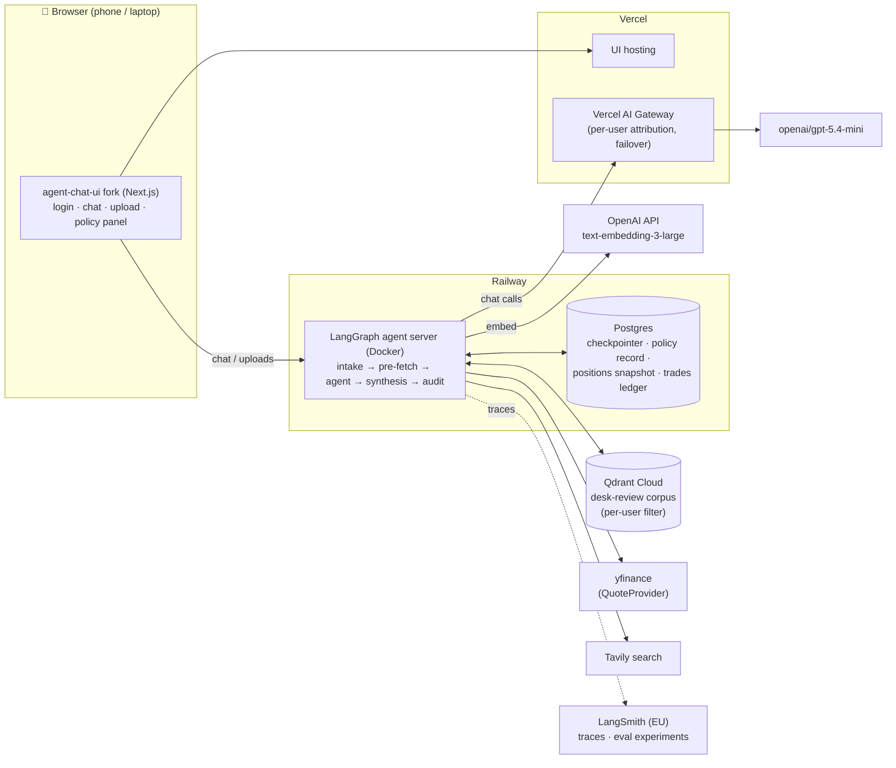
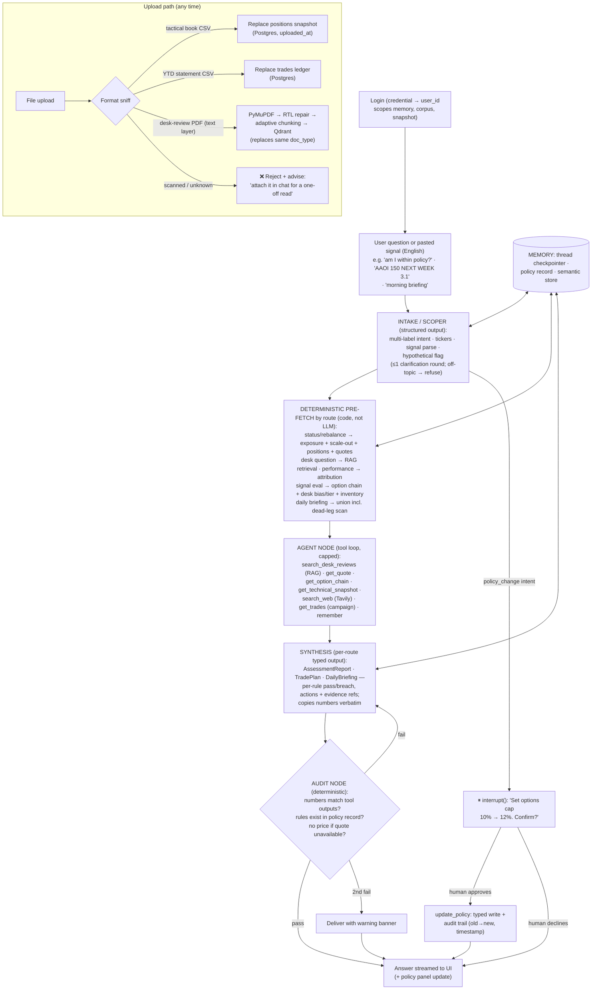

# Task 2 — Proposed Solution

**Role: AI Solutions Engineer**

> Deliverable for Task 2 of the Certification Challenge. Problem, audience, and the
> "today" workflow live in `[task1_problem_scope.md](task1_problem_scope.md)`. The
> architectural decisions referenced here are recorded as ADRs in `[adr/](adr/)` and the
> full build plan in `[build_plan.md](build_plan.md)`.

---

## 1. One-sentence solution

> A browser-based agentic assistant that holds the trader's uploaded book and his desk's
> Hebrew market reviews in persistent memory, checks every position against his own
> exposure rules with deterministic math, and answers *exactly what to change*.

**How it kills the Task 1 pains:** the **synthesis (H)** — reconciling positions vs.
rules vs. thesis and deciding the rebalance — is now the agent's job, delivered as a
typed, audited report instead of raw context for the trader to interpret. The **re-upload
loop (D)** collapses to *once per change*: uploads persist in server-side memory, so the
assistant is never stale between questions. The **oversized-files problem (G)** is solved
structurally — the full-year statement is parsed once into a queryable trades ledger
(deterministic tools, not context stuffing), so full-year trade tracing works for the
first time. The **unverified-verdict pain (I)** is answered by construction rather than
by prompting: every number comes from deterministic, FX-normalized code (a SEK position
can never be read as USD), synthesis must copy figures verbatim, and a deterministic
audit node blocks any number that doesn't trace to a tool output — so a
confident-but-wrong verdict is structurally unable to reach the trader unflagged.
Manual export from IB (**B**) remains, by explicit scope decision
(ADR-0001): a live broker feed is a Demo Day evolution, not a certification-week build.

---

## 2. Infrastructure — components and why each was chosen

| #   | Component               | Choice                                                                                                  | Why (one sentence)                                                                                                                                                                                                                                       |
| --- | ----------------------- | ------------------------------------------------------------------------------------------------------- | -------------------------------------------------------------------------------------------------------------------------------------------------------------------------------------------------------------------------------------------------------- |
| 1   | **LLM**                 | `openai/gpt-5.4-mini` (via gateway)                                                                     | Strong, cheap tool-caller that reads Hebrew and answers in English; the gateway makes a frontier-model swap a config change if evals demand it.                                                                                                          |
| 2   | **LLM gateway**         | **Vercel AI Gateway**                                                                                   | Satisfies the gateway requirement while adding per-user spend attribution, budget alerts, and model failover.                                                                                                                                            |
| 3   | **Agent orchestration** | **LangGraph ≥ 1.0**                                                                                     | The structured graph (intake → pre-fetch → agent → synthesis → audit) plus native `interrupt()`, checkpointer, and Store are exactly the guardrail primitives this design needs (ADR-0006).                                                              |
| 4   | **Tools**               | Purpose-built deterministic pandas tools + `yfinance` (behind a `QuoteProvider` interface) + **Tavily** | Financial math must be exact and testable — never LLM arithmetic (ADR-0002); yfinance is the only free source covering options chains and international tickers; Tavily handles the *narrative* ("what moved and why").                                  |
| 5   | **Embedding model**     | OpenAI `text-embedding-3-large` (direct, not via gateway)                                               | Every retrieval is cross-lingual (English questions ↔ Hebrew corpus), which demands the stronger multilingual embedder; embeddings don't route through the gateway.                                                                                      |
| 6   | **Vector DB**           | **Qdrant Cloud** (free tier)                                                                            | Persistent across deploys (daily uploads survive restarts), per-user isolation via a `user_id` payload filter (ADR-0005), and API-compatible with the course stack.                                                                                      |
| 7   | **Memory**              | LangGraph **checkpointer** (threads) + **PostgresStore** on Railway Postgres                            | The required memory component: short-term thread state ends the re-upload loop, and the store persists the trader's **exposure policy as a typed, runtime-editable procedural record** (ADR-0003) plus user-scoped semantic memory (segment membership). |
| 8   | **Monitoring**          | **LangSmith** (EU endpoint) + AI Gateway dashboard                                                      | LangSmith holds full traces and eval experiments privately (the committed artifacts are summary tables only, per ADR-0005); the gateway dashboard tracks spend per user.                                                                                 |
| 9   | **Evaluation**          | pytest + custom retrieval metrics + **RAGAS**, orchestrated as LangSmith experiments                    | Three layers matching the architecture's own split: golden-value tests for deterministic tools, hit-rate/MRR against an exhaustive answer key for retrieval, LLM-judged faithfulness plus a synthesis rubric end-to-end.                                 |
| 10  | **User interface**      | Forked `agent-chat-ui` (Next.js)                                                                        | Proven streaming chat against a LangGraph server, extended with a credential login, a format-sniffing upload control, and a live policy panel — responsive in a phone or laptop browser.                                                                 |
| 11  | **Deployment**          | **Railway** (agent server, Docker) + **Vercel** (UI)                                                    | A real long-running server for ingestion/pandas workloads plus one-click Postgres, and a battle-tested split already deployed once in session 9; the public endpoint is login-gated (ADR-0005).                                                          |
| 12  | **Ingestion**           | PyMuPDF + deterministic RTL-repair + adaptive structure-aware chunker                                   | The Hebrew desk reviews need structure-preserving extraction with mechanical artifact repair (ADR-0004), and per-document heading detection because the desk's template drifts between issues.                                                           |

---

## 3. Agent workflow — end to end

**How a question flows.** The trader logs in (his `user_id` scopes every store — his data
never mixes with the demo account's synthetic data) and asks, in English, something like
*"how am I doing — and is my hedge still right for where the market's heading?"* The
**intake node** classifies it with structured output — multi-label intent
(`status_check` + `market_regime`), extracted tickers, and a *hypothetical* flag so
"what if I raised my cap?" is analyzed rather than enacted; ambiguous questions get one
clarification round. Its route then triggers a **deterministic pre-fetch**: graph code —
not model discretion — *always* runs the exposure check, scale-out scan, position list,
and index/technical snapshot for a status question, so the compliance math that matters
can never be skipped. The **agent node** fills the gaps agentically: retrieving from the
desk-review corpus (cross-lingual RAG over the latest daily + weekly, where the *daily
supersedes the weekly on conflict*), pulling quotes, or calling Tavily when the question
needs today's narrative. The same machinery serves his two highest-frequency routes
(ADR-0007): pasting a Discord signal (*"AAOI 150 NEXT WEEK 3.1"*) yields a typed
**TradePlan** — max contracts under his sizing rules, the DTE-tier exit levels, the
desk's tier on the name, inventory conflicts, and an honest "IV rank unavailable —
check manually" line — while *"morning briefing"* composes the exposure, scale-out,
and dead-leg scans with the desk's latest read into a start-of-day **DailyBriefing**.
**Synthesis** assembles a typed report — per-rule pass/breach
with the computed numbers, concrete trim/add/hedge actions each tied to a rule or a
desk-thesis citation — copying every figure verbatim from tool evidence. A deterministic
**audit node** then verifies exactly that: every number must match a tool output, every
cited rule must exist in the policy record, and no price may appear if a quote was
unavailable; one failed audit bounces back to synthesis, a second delivers with a visible
warning banner rather than silently guessing.

**Where the human stays in the loop.** Two gates, one soft and one hard. The hard gate:
changing the trader's own rules (*"raise my options cap to 12%"*) routes through a
LangGraph `interrupt()` — the agent reads the change back and **waits for explicit
confirmation** before writing the typed policy record, with an audit trail of old value,
new value, and timestamp (ADR-0003). The soft gate is structural: the application **never
executes trades** — every recommendation terminates at the trader, who remains the only
actor able to act on his book, so every output is human-reviewed by construction. Memory
makes the whole loop stick: the thread checkpointer carries the conversation, the
positions snapshot and trades ledger persist across restarts, and the policy record and
segment definitions live in the long-term store — so the trader uploads once per change,
asks as often as he likes, and the assistant is current until the book actually changes
again.